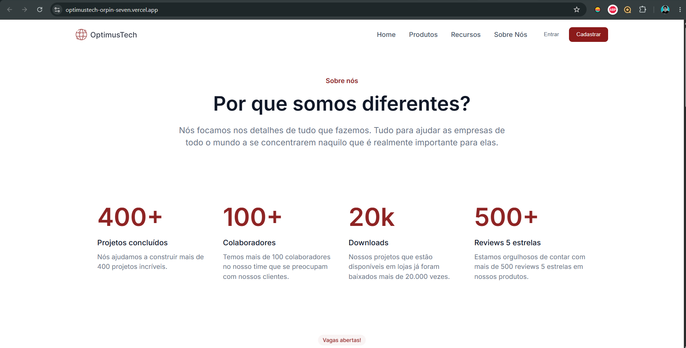

# 🚀 OptimusTech - Desafio #7DaysOfCode

Página institucional moderna e responsiva desenvolvida para a OptimusTech, focada na apresentação dos valores da empresa, métricas de sucesso, vagas abertas e captação de talentos. Este projeto foi o resultado final do desafio prático de 7 dias promovido pela Giovanna Moeller.

## 🔗 Demonstração

Você pode visualizar o projeto online clicando no link abaixo:
👉 https://optimustech-orpin-seven.vercel.app/

---

## 📷 Screenshots do Projeto

  

---

## 🛠️ Tecnologias e Conceitos Utilizados

O desenvolvimento foi focado em escrever um código limpo, semântico e alinhado com as boas práticas do mercado:

* **HTML5 Semântico:** Uso correto de tags como `<header>`, `<section>`, `<blockquote\>`, `<footer>`, `<form>` e `<input type="email">` para garantir acessibilidade e SEO.
* **CSS3 Customizado:** Estilização baseada em variáveis e tokens de design direto do Figma.
* **Flexbox Layout:** Utilizado para criar alinhamentos complexos, como a navbar, o grid de vagas, e o alinhamento lado a lado da newsletter e do rodapé.
* **Design Responsivo:** Layout adaptável para diferentes tamanhos de tela (Mobile e Desktop).

---

## 🎯 O que eu aprendidi neste desafio?

Durante os 7 dias de imersão, pude consolidar fundamentos essenciais para a minha evolução como Desenvolvedor Front-End:
1.  **Leitura e Interpretação de Telas no Figma:** Extração correta de paddings, margens, cores (Tokens) e tamanhos de fonte.
2.  **Organização de Arquivos:** Estruturação correta de pastas de recursos (`assets/css/`, `assets/images/`).
3.  **Resolução de Bugs Reais:** Identificação de falhas de fechamento de tags e gerenciamento do fluxo do HTML.
4.  **Versionamento com Git/GitHub:** Uso do terminal para inicializar, commitar e realizar o push do projeto concluído.

---

## 👤 Autor

Desenvolvido por **Dorgivaldo Nunes de Alcântara** 👋 

* LinkedIn: https://www.linkedin.com/in/dorgivaldo-nunes/